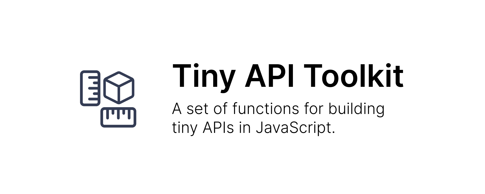

[](cover.png)

> A set of functions for building tiny APIs in JavaScript.

[](https://github.com/neogeek/tiny-api-tools/actions/workflows/test.workflow.yml)
[](https://github.com/neogeek/tiny-api-tools/actions/workflows/publish.workflow.yml)
[](https://jsr.io/@neogeek/tiny-api-tools)
[](https://jsr.io/@neogeek/tiny-api-tools)

## Install

### Deno

```bash
deno add jsr:@neogeek/tiny-api-tools
```

### NPM

```bash
npx jsr add @neogeek/tiny-api-tools
```

## Usage

### Deno

```typescript
import { JsonResponse } from 'jsr:@neogeek/tiny-api-tools/http';

import { handleRoutesWithRequest } from 'jsr:@neogeek/tiny-api-tools/request';

Deno.serve({ port: 8080 }, async (req) => {
  return await handleRoutesWithRequest(req, [
    {
      pattern: '/',
      handler: () => new JsonResponse({ version: '1.0.0' }),
    },
    {
      pattern: '/hello/:name?',
      handler: ({ values }) =>
        new JsonResponse({
          message: `Hello, ${values.name || 'world'}!`,
        }),
    },
  ]);
});
```

### Node.js

```javascript
import { createServer } from 'node:http';

import { JsonResponse } from '@neogeek/tiny-api-tools/http';

import { handleRoutesWithUrl } from '@neogeek/tiny-api-tools/url';

const PORT = process.env.PORT || 8080;

const server = createServer(async (req, res) => {
  const url = new URL(req.url, `http://localhost:${PORT}/`);

  const response = await handleRoutesWithUrl(req.method, url, [
    {
      pattern: '/',
      handler: () => new JsonResponse({ version: '1.0.0' }),
    },
    {
      pattern: '/hello/:name?',
      handler: ({ values }) =>
        new JsonResponse({
          message: `Hello, ${values.name || 'world'}!`,
        }),
    },
  ]);

  res.statusCode = response.status;
  res.setHeaders(response.headers);
  res.end(await response.text());
});

server.listen(PORT, () => {
  console.log(`Server running at http://localhost:${PORT}/`);
});
```

## Request Pattern

Request patterns are similar to how routes are defined in frameworks like express.

Each pattern consists of static names `/version` and variable names `/:username`. These can be used in any order you would like.

Variable name at the end of a pattern can be made optional by using a `?` character at the end of the pattern like this `/:org/:repo/:branch?`.

Trailing slashes are not required and won't prevent matching if the request doesn't include it.

## Examples

1. [Simple Server (Deno)](./examples/simple-server-deno/) - A simple server with two routes `/` and `/hello/:name?` built in Deno.
1. [Simple Server (Node.js)](./examples/simple-server-nodejs/) - A simple server with two routes `/` and `/hello/:name?` built in Node.js.

## License

[The MIT License (MIT)](./LICENSE)
